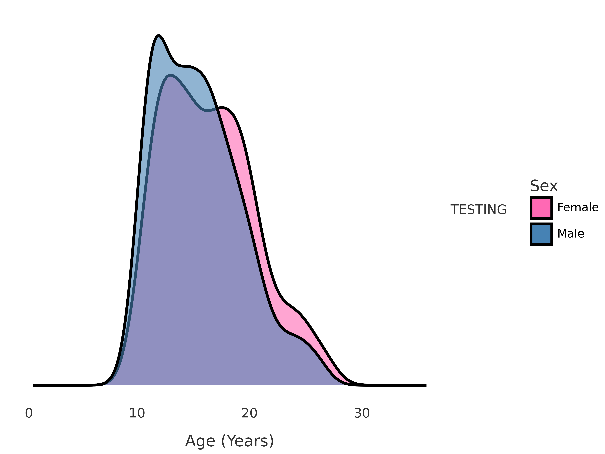
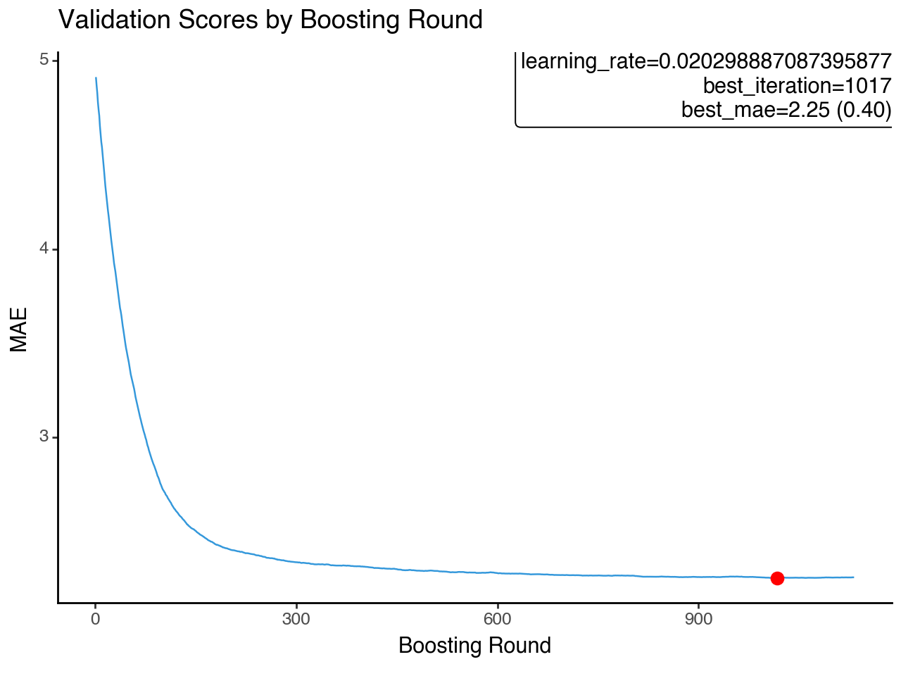
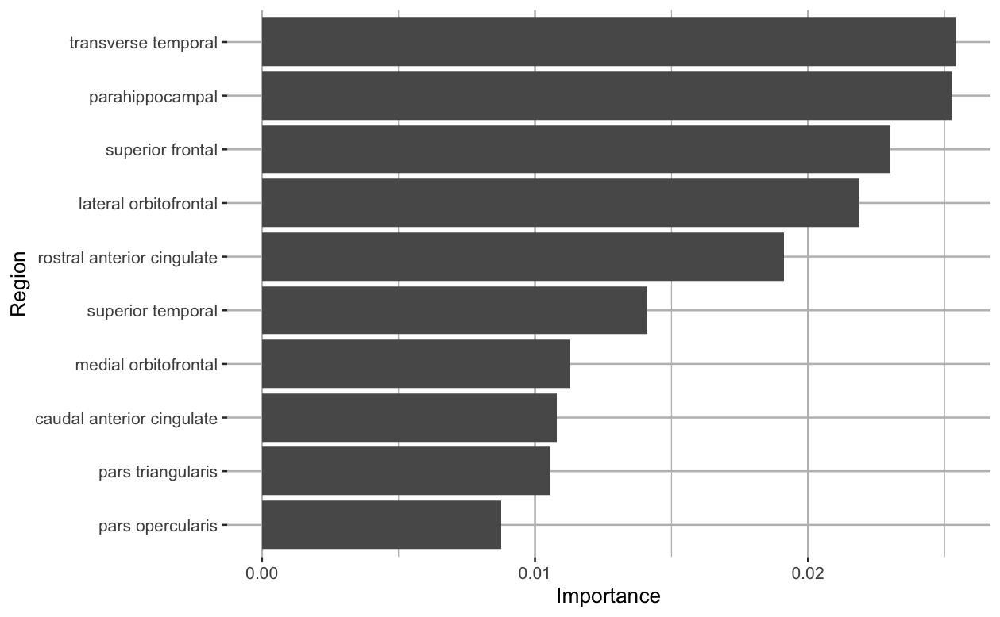
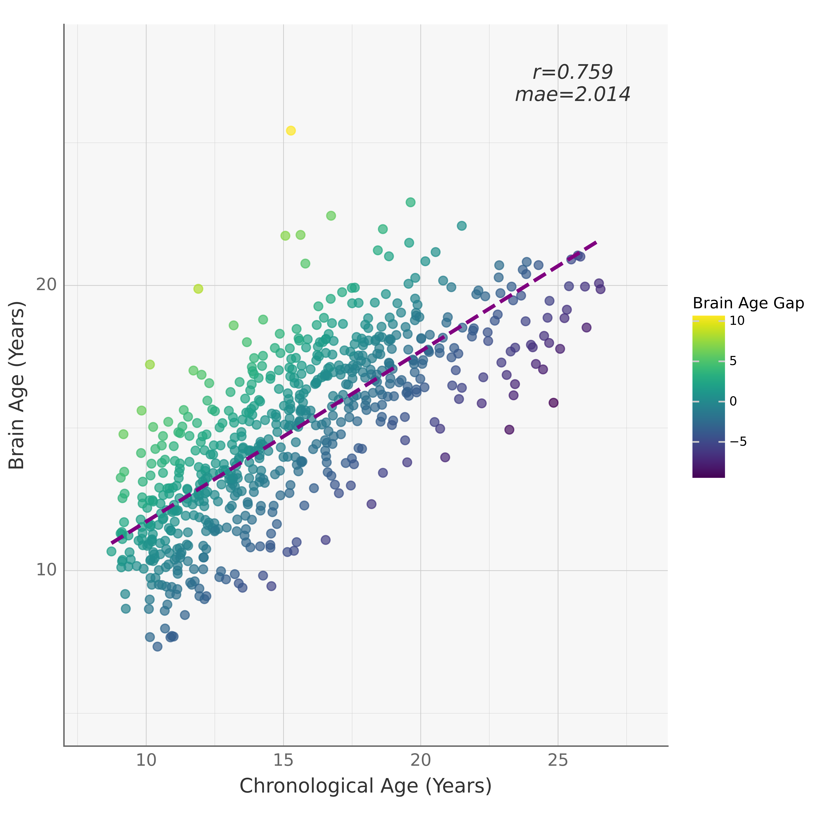
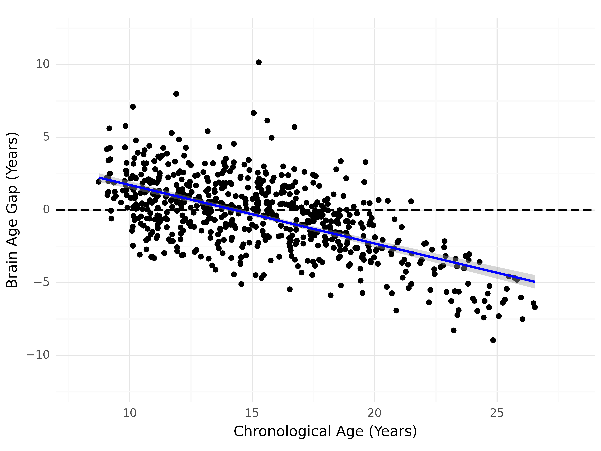
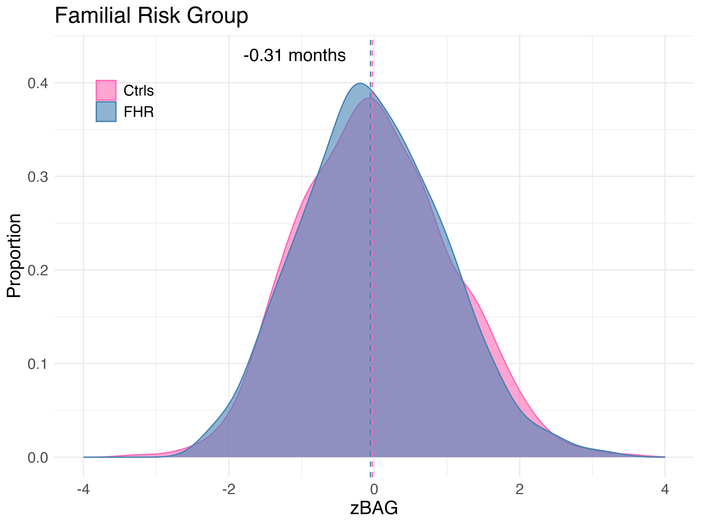
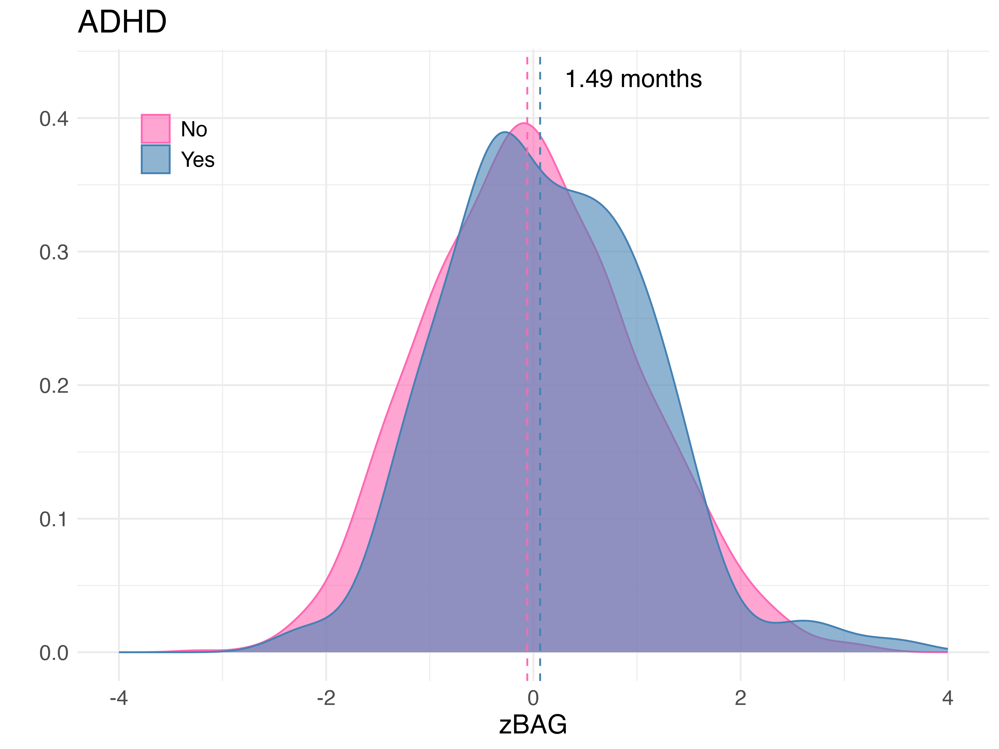
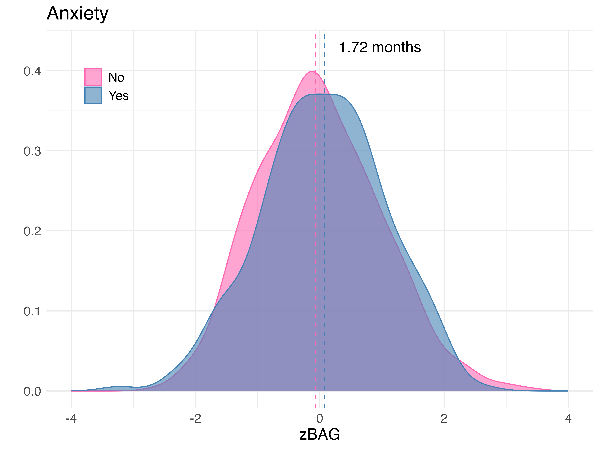

# Predicting brain age using XGBoost

- This repository contains scripts used to train and test a XGBoost model on structural MRI features (surface area and volume) for the prediction of age. This predicted age (i.e., brain age) is important because the error (predicted - chronological age) is indicative of mental illness. A higher error (i.e., brain age gap) is associated with accelerated brain aging, and mood disorders such as depression and bipolar disorder.

### Background and Hypothesis

- Previous literature shows that a higher brain age gap is associated with mental illness (Ballester et al., 2022). Are there any associations between brain age gap and developmental psychopathology (i.e., indicators of risk that are usually predictive of later onsets of mental illness)? 

### Training Data

- I used a training set that comprised of participants from 6 sites (ABIDE I & II, CMI, CORR, NIH and PING). The training sample included 2884 healthy participants (Mean age=15.43, SD=5.79); 2308 participants were used for training, while 576 were used as the validation set

– Age and sex distributions of the train and validation set

  
  

### Hyperparameter Optimization

- We ran hyperparameter optimization in Optuna, a model-agnostic framework that uses a bayesian algorithm (TPESampler) to find the best hyperparameters for a model (Akiba et al., 2019). Table 1 lists the search space for the hyperparameters that we used, and the values that provided the best performance. 

Table 1. Hyperparameters selected for fitting the XGBoost model

| Hyperparameter | Description | Search space | Best hyperparameters |
| --- | --- | --- | --- |
| Tree complexity parameters |
| Max_depth | The maximum number of splits the decision tree can make | [1, 9] | 5 |
| Min_child_weight | The minimum number of samples allowed in a split | [5, 36] | 11 |
| N_estimators | The numbers of decision trees combined to make a prediction | [50, 1500] | 1132 |
| Gamma | Sets the minimum threshold for a new split in the decision tree | LogUniform [1e-8, 1.0] | 3.9189261544558794e |
| Boosting parameters |
| Learning_rate | Controls the rate at which the model learns from the data | LogUniform [0.001, 1] | 0.020298887087395877 |
| Sampling parameters |
| Subsample | Proportion of rows to use in each tree | LogUniform [0.01, 1] | 0.42788905448945097 |
| Colsample_bytree | The fraction of columns available to each tree | LogUniform [0.01, 1] | 0.12663197349650007 |
| Regularization parameters |
| Reg_alpha | Simplifies the model by removing unnecessary features | LogUniform[1e-8, 1.0] | 4.5298907132046936e-07 |
| Reg_lambda | Controls overfitting by adding a penalty to the (complex) models | LogUniform[1e-8, 1.0] | 3.062741274082719e-06 |

### Testing Data

- Testing Set: We estimated brain age on 274 participants from the FORBOW cohort (673 scans, Mean age=15.20,SD=4.00). We then estimated BAG (BAG = predicted age – chronological age).

  

### Model performance

- To measure the performance of the model, we tested on the validation dataset (Figure 1). We used the mean absolute error (MAE), which represents the absolute difference between the predicted brain age and chronological age, as the evaluation metric. The model performed well on the validation dataset, achieving an MAE of 2.25 (0.40) (Figure 1). Below is also a figure showing the top 10 features that contributed the most to the model's performance. 

  
  

#### Predictions

- The XGBoost model performed well on our test set as seen in the scatter plot below. Additionally, the model has a bias (higher predictions for lower ages, lower predictions for higher ages), which we corrected for (Smith et al., 2019). 

  
   

### Associations of brain age gap with developmental psychopathology

- The promise of brain age prediction is its use for predicting mental illness. In the current study, we aimed to understand whether brain age gap had any associations with developmental psychopathology (adhd, anxiety, psychotic symptoms). An understanding of this relationship would inform the usefulness of BAG in predicting later mental illnesses.

- We did not find any significant associations with anxiety, ADHD or depression.

  
   
  

- Additionally, in a sensitivity analysis, we didn't find any significant relationship between brain age gap and other psychopathology.

  

### Next steps

- If we can get access to more data, some of the exciting follow ups I would like to investigate are:
  1. Use multimodal data to predict brain age and see if that leads to different results
  2. Use a foundational model (Dufumier et al., 2021) to predict brain age 

### References

  1. Ballester, P. L., Romano, M. T., de Azevedo Cardoso, T., Hassel, S., Strother, S. C., Kennedy, S. H., & Frey, B. N. (2022). Brain age in mood and psychotic disorders: a systematic review and meta-analysis. Acta psychiatrica Scandinavica, 145(1), 42–55. https://doi.org/10.1111/acps.13371
  2. Akiba, T., Sano, S., Yanase, T., Ohta, T., & Koyama, M. (2019). Optuna: A Next-generation Hyperparameter Optimization Framework. Proceedings of the 25th ACM SIGKDD International Conference on Knowledge Discovery & Data Mining.
  3. Smith, S. M., Vidaurre, D., Alfaro-Almagro, F., Nichols, T. E., & Miller, K. L. (2019). Estimation of brain age delta from brain imaging. NeuroImage, 200, 528–539. https://doi.org/10.1016/j.neuroimage.2019.06.017
  4. Dufumier, B., Gori, P., Victor, J., Grigis, A., Wessa, M., Brambilla, P., Favre, P., Polosan, M., Mcdonald, C., Piguet, C., & Duchesnay, E. (2021). Contrastive Learning with Continuous Proxy Meta-Data for 3D MRI Classification. International Conference on Medical Image Computing and Computer-Assisted Intervention.

